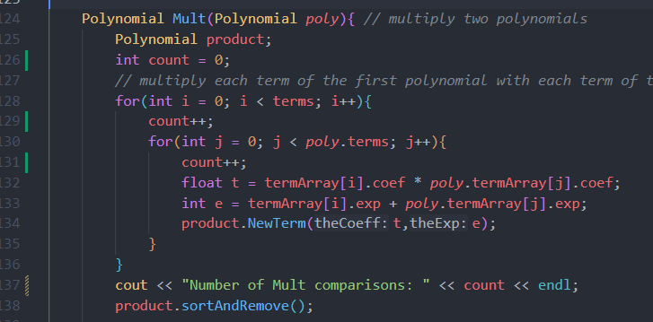

# HW 2-Polynomial

## 1. 解題說明

基於題目提供之ADT實作多項式類別(`Polynomial`)與`Term`類別，根據題目要求，多項式類別提供以下功能：

### Method

建構函數:

多項式相加(`Add`):

多項式相乘(`Mult`):

計算多項式結果(`Eval`):

新增非0項次(`NewTerm`):

### Operator overloading

輸入運算子(`<<`)

輸出運算子(`>>`)

對於`Term`類別，為了排序，也對其`>`、`<`實作Operator overloading

### 實作邏輯

1. 使用類別 `Term` 來表示多項式中的每一項，包括係數 (coef) 和指數 (exp)

2. 在 `Polynomial` 類別中維護一個動態陣列 `termArray` 來儲存所有的 `Term`，並設計動態調整容量
3. 針對加法與乘法運算，遍歷兩個多項式的項目進行計算，結果儲存於新的 `Polynomial` 物件中，最後排序並合併同指數項
4. 在輸入時，將依照指數由小到大排序。加法與乘法運算後的結果則是由大到小排序
5. 在輸出時，對於指數為0或是為1的項次特別處理顯示

## 2. Algorithm Design &  Programming

```cpp
#include <cstdlib>
#include <iostream>
#include <string>
#include <cmath>    // abs()
#include <algorithm> // copy(), sort()
#include <sstream> // stringstream

using namespace std;

class Polynomial; // forward declaration


/* Term Class */
class Term{

friend Polynomial;
friend ostream& operator<<(ostream& os, const Polynomial& poly);
friend istream& operator>>(istream& is, Polynomial& poly);
friend bool operator<(const Term& t1, const Term& t2);
friend bool operator>(const Term& t1, const Term& t2);

public:
    Term(float coef = 0,int exp = 0){ // constructor
        this->coef = coef;
        this->exp = exp;
    }

private:
    float coef;
    int exp;
};

bool operator<(const Term& t1, const Term& t2) { // compare the exponents
    return t1.exp < t2.exp;
}

bool operator>(const Term& t1, const Term& t2) { // compare the exponents
    return t1.exp > t2.exp;
}

/* Polynomial Class */
class Polynomial{

friend ostream& operator<<(ostream& os, const Polynomial& poly);
friend istream& operator>>(istream& is, Polynomial& poly);

public:
    Polynomial(){ // constructor
        capacity = 8;
        termArray = new Term[capacity];
        terms = 0;
    }
    ~Polynomial(){ // destructor
        delete[] termArray;
    }
    
    Polynomial(const Polynomial& poly){ // copy constructor
        capacity = poly.capacity;
        terms = poly.terms;
        termArray = new Term[capacity];
        copy(poly.termArray,poly.termArray+terms,termArray);
    }

    // sort and remove the same exponent
    void sortAndRemove(){ // 小到大排序並移除相同指數的項
        sort(termArray,termArray+terms,[](Term t1,Term t2){return t1.exp > t2.exp;}); // sort the terms by the exponent
        for(int i = 0; i < terms; i++){
            for(int j = i+1; j < terms; j++){
                if(termArray[i].exp == termArray[j].exp){
                    termArray[i].coef += termArray[j].coef;
                    for(int k = j; k < terms - 1; k++){
                        termArray[k] = termArray[k+1];
                    }
                    terms--;
                }
            }
        }
    }

    Polynomial Add(Polynomial poly){ // add two polynomials

        Polynomial sum;
        int aPos = 0, bPos = 0; // position of the terms in the two polynomials
        while((aPos < terms) && (bPos < poly.terms)){ 
            if(termArray[aPos].exp == poly.termArray[bPos].exp){ // 如果兩個項的指數相同
                float t = termArray[aPos].coef + poly.termArray[bPos].coef; 
                if(t) sum.NewTerm(t,termArray[aPos].exp); // 如果t不為0,則加入到sum中
                aPos++; bPos++;
            }
            else if(termArray[aPos].exp < poly.termArray[bPos].exp){ // 如果第一個項的指數小於第二個項的指數
                sum.NewTerm(poly.termArray[bPos].coef,poly.termArray[bPos].exp); // 將第二個項加入到sum中
                bPos++;
            }
            else{
                sum.NewTerm(termArray[aPos].coef,termArray[aPos].exp); // 將第一個項加入到sum中
                aPos++;
            }
        }

        for(;aPos < terms;aPos++){ // add the remaining terms
            sum.NewTerm(termArray[aPos].coef,termArray[aPos].exp);
        }
        for(;bPos < poly.terms;bPos++){ // add the remaining terms
            sum.NewTerm(poly.termArray[bPos].coef,poly.termArray[bPos].exp);
        }

        sum.sortAndRemove();

        return sum;

    }

    Polynomial Mult(Polynomial poly){ // multiply two polynomials
        Polynomial product;
        // multiply each term of the first polynomial with each term of the second polynomial
        for(int i = 0; i < terms; i++){ 
            for(int j = 0; j < poly.terms; j++){
                float t = termArray[i].coef * poly.termArray[j].coef;
                int e = termArray[i].exp + poly.termArray[j].exp;
                product.NewTerm(t,e);
            }
        }

        product.sortAndRemove();

        return product;

    }
    

    float Eval(float x) { // evaluate the polynomial at a given value of x
        float sum = 0;
        for(int i = 0; i < terms; i++){
            sum += termArray[i].coef * pow(x,termArray[i].exp);
        }
        return sum;
    }
    
    void NewTerm(float theCoeff,int theExp) { // add a new term to the polynomial
        if(terms == capacity) // if the array is full
        {
            capacity *= 2;
            Term *temp = new Term[capacity];
            copy(termArray,termArray+terms,temp);
            delete[] termArray;
            termArray = temp;
        }
        termArray[terms].coef = theCoeff;
        termArray[terms++].exp = theExp;
    }


private:
    Term* termArray;
    int capacity;
    int terms;
};

ostream& operator<<(ostream& os, const Polynomial& poly){
    if(poly.terms == 0){
        os << "0";
        return os;
    }

    if(poly.termArray[0].coef < 0){
        os << "-"; // if the first term is negative
    }
    for(int i = 0; i < poly.terms; i++){
        os << abs(poly.termArray[i].coef); // abs() to get the absolute value

        if(poly.termArray[i].exp != 0){
            os << "x";
            if(poly.termArray[i].exp != 1){
                os << "^" << poly.termArray[i].exp;
            }
        }

        if(i != poly.terms - 1){
            if(poly.termArray[i+1].coef < 0){
                os << " - ";
            }
            else{
                os << " + ";
            }
        }
    }
    return os;
}


istream& operator>>(istream& is, Polynomial& poly){ // second version -> 以空白分隔 5x+2x^2+3x^3 == 5 1 2 2 3 3
    /*
        使用陣列實作，先對輸入的項數進行排序，再合併同樣指數的項，最後將合併後的項放入poly，可以減少排序和合併的時間複雜度
    */
    
    int tSize = 8;
    Term *tArr = new Term[tSize];

    float coef;
    int exp;

   
    cout << "Enter terms (coef exp), one pair per term, and press Enter to finish:\n";

    string line;
    getline(cin, line); // 讀取整行輸入
    stringstream ss(line); // 用stringstream解析這行輸入

    int i = 0;
    while (ss >> coef >> exp) { // 從解析流中提取係數和指數
        if (i == tSize) { // 如果陣列不夠大,擴大陣列
            tSize *= 2;
            Term *newArr = new Term[tSize];
            for (int j = 0; j < i; j++) {
                newArr[j] = tArr[j];
            }
            delete[] tArr;
            tArr = newArr;
        }
        tArr[i] = Term(coef, exp);
        i++;
    }
    // 將指數由小到大排序,coef也要跟著移動
    sort(tArr, tArr+i, [](Term t1, Term t2) { return t1 < t2; });

    // 合併同樣指數的項
    int j = 0;
    for (int k = 1; k < i; k++) { // k是目前的位置
        if (tArr[k].exp == tArr[j].exp) { // 如果指數相同,合併
            tArr[j].coef += tArr[k].coef;
        } else { // 否則,將k的項移到j+1的位置
            j++;
            tArr[j] = tArr[k];
        }
    }

    // 將合併後的項放入poly
    poly.terms = j+1; // 有j+1個項
    poly.capacity = tSize; 
    delete[] poly.termArray; // 刪除原本的項
    poly.termArray = new Term[tSize];
    for (int k = 0; k <= j; k++) { 
        poly.termArray[k] = tArr[k];
    }

    return is;
}

int main()
{
    /*
    // input output test
    Polynomial p;
    cin >> p;
    cout << p << endl;
    */

    
    // test code
    Polynomial p1,p2;

    cin >> p1 >> p2;
    
    cout << p1.Add(p2) << endl;

    cin >> p1 >> p2;

    cout << p1.Mult(p2) << endl;

    Polynomial p;

    cin >> p;

    cout << p.Eval(2) << endl;
    
    system("pause");

    return 0;
}
```

## 3. 效能分析/Analysis

### 3-1. Time complexity

#### `sortAndRemove` 函數

1. 使用 `std::sort` 排序陣列，時間複雜度為 $O(n \log n)$
2. 合併同指數的項時，最壞情況需要 $O(n^2)$（當所有項的指數相同且需要進行大量位移時）
3. 綜合為$O(n^2)$

#### 加法與乘法 (`Add` 和 `Mult`)

1. 加法需遍歷兩個多項式的所有項，時間複雜度為 $O(m+n)$ ( $m$ 與 $n$ 為兩個多項式的項數，也就是 `terms`)
2. 乘法需進行兩層巢狀迴圈以計算所有項的乘積，時間複雜度為 $O(m \times n)$

#### 計算函數(`Eval`)

1. 遍歷多項式中的所有項，時間複雜度為 $O(n)$

### 3-2. Space complexity

1. 動態陣列`termArray`佔用空間為 $O(n)$ ，其中 $n$ 為多項式的項數，也就是 `terms`

2. 加法和乘法的結果需要新的`Polynomial`物件，最壞情況下需額外的 $O(m+n)$ 或 $O(m \times n)$ 空間

## 4. 測試與驗證(Testing and Proving)

### 測試案例

#### 多項式加法

Input: `p1 = 3x^2 + 2x + 1`，`p2 = x^2 + x + 4`

cmd:`3 2 2 1 1 0` `1 2 1 1 4 0`

Output:`4x^2 + 3x + 5`

#### 多項式乘法

Input: `p1 = 2x + 1`，`p2 = x + 3`

cmd:`2 1 1 0` `1 1 3 0`

Output:`2x^2 + 7x + 3`

#### 計算多項式

Input: `p = 3x^2 + 2x + 1`，`p.Eval(x = 2)`

cmd:`3 2 2 1 1 0`

Output:`17`

### TestImg


## 5. 效能量測 (Measuring)





## 6. 心得討論

透過多項式類別的實作，深入理解了動態陣列的使用、運算子重載的實現以及多項式加法與乘法的具體邏輯

然而，這次使用陣列來維護TermArray的方式如果中途要插入項次，需要花費$O(n)$的時間複雜度，很不便利

在這次實作中，我發現，使用List的方式更適合多項式，List的缺點只有在查找某個值會比Array花費更多時間。

多項式不會用到查找，在做運算都是走訪，所以不會有這個缺點，使用List卻可以讓多項式變得更加有彈性

此外，在這次實作運算子重載的時候，也意識到最初的寫法的問題，在後續有進行修正。
