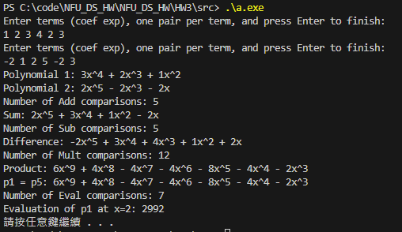
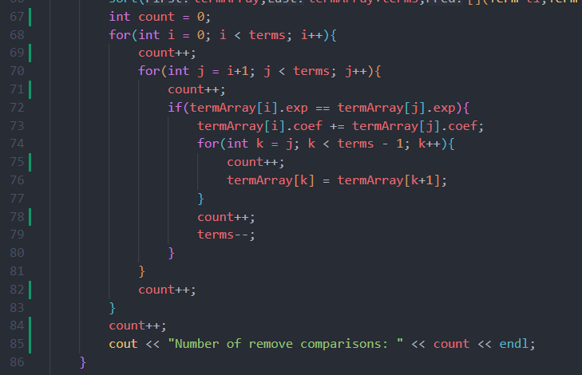
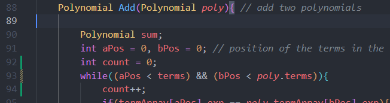
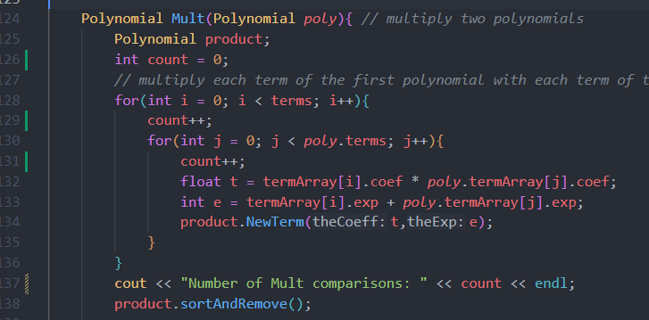
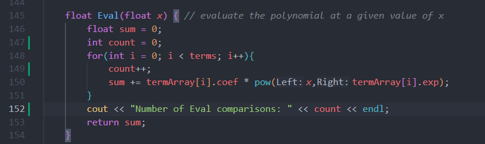
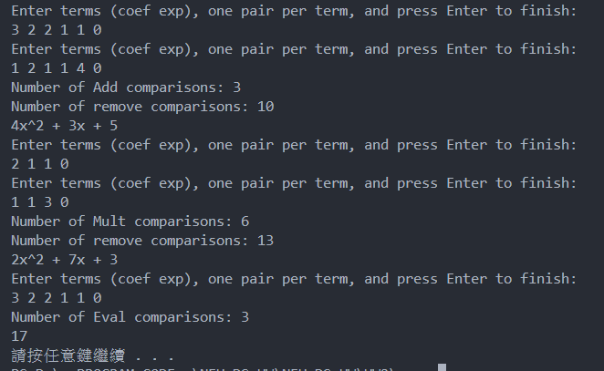

# HW 2-Polynomial

## 1. 解題說明

題目要求實現多項式類別(`Polynomial`)，且使用頭節點的循環鏈結串列(`circular linked lists`)。多項式的每一項表示為一個節點，節點包含三個資料成員:`coef`,`exp`,`link`。

### 多項式的儲存方式

1.每個多項式將表示為具有頭節點的循環鏈結串列(環)。

2.為了高效地刪除多項式，必須使用“可用空間列表”（available-space list）及相關函數。

3.多項式外部表示被假定為:n, c₁, e₁, c₂, e₂, c₃, e₃, ..., cₙ, eₙ，在此處進行了優化，使用者無需輸入n，可以直接輸入多項式c₁, e₁, c₂, e₂, c₃, e₃, ..., cₙ, eₙ。

4.指數以降序排列，即e₁ > e₂ > e₃ > ... > eₙ。


多項式需要完成以下的功能:

### Constructor
複製建構函數:將多項式 a 賦值給當前多項式 *this
```cpp
Polynomial() { // constructor
    availableList = nullptr;
    head = nullptr;
}
Polynomial(const Polynomial& poly) { // copy constructor
    cout << "Copy constructor called" << endl;
    head = nullptr;
    availableList = nullptr;

    PolynomialNode* temp = poly.head;
    if(temp == nullptr) return;
    do {
        InsertNode(head, temp->coef, temp->exp);
        temp = temp->link;
    } while (temp != poly.head);
}
```
### Destructor
解構函數:釋放多項式 *this 所有的節點，將它們返回到“可用空間列表”
```cpp
~Polynomial() { // destructor
    clearList(head);
    //clearAvailableList();
}
void clearList(PolynomialNode*& head) {
    if (head == nullptr) return;

    PolynomialNode* curr = head;
    do {
        PolynomialNode* temp = curr;
        curr = curr->link;
        freeNode(temp);
    } while (curr != head);

    head = nullptr; // 清空後設置頭指針為空
}


void clearAvailableList() {
    while (availableList != nullptr) {
        PolynomialNode* temp = availableList;
        availableList = availableList->link;
        delete temp; // 釋放節點
    }
}
```

### available-space list
```cpp
PolynomialNode* allocateNode() { // allocate a new node
    cout << "Allocate node called" << endl;
    if (availableList != nullptr) {
        PolynomialNode* newNode = availableList;
        availableList = availableList->link;

        newNode->coef = 0;
        newNode->exp = 0;
        newNode->link = nullptr;

        return newNode;
    }

    return new PolynomialNode(0, 0, nullptr);
}

void freeNode(PolynomialNode* node) { // free a node
    cout << "Free node called" << endl;
    if (node == nullptr) return;
    node->link = availableList;
    availableList = node;
}
```

### Method


多項式相加(`Add`):

```cpp
Polynomial Add(const Polynomial& poly) { // add two polynomials
    Polynomial sum;
    if (head == nullptr && poly.head == nullptr) return sum;
    PolynomialNode* aPos = head;
    PolynomialNode* bPos = poly.head;
    int count = 0;

    bool aComplete = false;
    bool bComplete = false;

    do {
        count++;
        if(aComplete || bComplete) {
            if(aComplete) {
                sum.InsertNode(sum.head, bPos->coef, bPos->exp);
                bPos = bPos->link;
                if (bPos == poly.head) bComplete = true; // 標記 bPos 已完成一圈
            } else {
                sum.InsertNode(sum.head, aPos->coef, aPos->exp);
                aPos = aPos->link;
                if (aPos == head) aComplete = true; // 標記 aPos 已完成一圈
            }
            continue;
        }
        if (aPos->exp == bPos->exp) {
            float t = aPos->coef + bPos->coef;
            if (t != 0)
            {
                sum.InsertNode(sum.head, t, aPos->exp);
            }
            aPos = aPos->link;
            bPos = bPos->link;
            if (aPos == head) aComplete = true; // 標記 aPos 已完成一圈
            if (bPos == poly.head) bComplete = true; // 標記 bPos 已完成一圈
        } else if (aPos->exp > bPos->exp) {
            sum.InsertNode(sum.head, aPos->coef, aPos->exp);
            aPos = aPos->link;
            if (aPos == head) aComplete = true; // 標記 aPos 已完成一圈
        } else {
            sum.InsertNode(sum.head, bPos->coef, bPos->exp);
            bPos = bPos->link;
            if (bPos == poly.head) bComplete = true; // 標記 bPos 已完成一圈
        }
    } while (!aComplete || !bComplete);

    cout << "Number of Add comparisons: " << count << endl;

    return sum;
}
```

多項式相乘(`Mult`):

```cpp
Polynomial Mult(const Polynomial& poly) { // multiply two polynomials
    Polynomial product;
    if (head == nullptr || poly.head == nullptr) return product;
    PolynomialNode* aPos = head;
    
    int count = 0;

    do {
        count++;
        PolynomialNode* bPos = poly.head;
        do {
            count++;
            float t = aPos->coef * bPos->coef;
            int e = aPos->exp + bPos->exp;
            product.InsertNode(product.head, t, e);
            bPos = bPos->link;
        } while (bPos != poly.head);
        aPos = aPos->link;
    } while (aPos != head);

    cout << "Number of Mult comparisons: " << count << endl;

    return product;

}
```

多項式相減(`Sub`):

```cpp
Polynomial Sub(const Polynomial& poly) { // subtract two polynomials
    Polynomial sum;
    if (head == nullptr && poly.head == nullptr) return sum;
    PolynomialNode* aPos = head;
    PolynomialNode* bPos = poly.head;
    int count = 0;

    bool aComplete = false;
    bool bComplete = false;

    do {
        count++;
        if(aComplete || bComplete) {
            if(aComplete) {
                sum.InsertNode(sum.head, -bPos->coef, bPos->exp);
                bPos = bPos->link;
                if (bPos == poly.head) bComplete = true; // 標記 bPos 已完成一圈
            } else {
                sum.InsertNode(sum.head, aPos->coef, aPos->exp);
                aPos = aPos->link;
                if (aPos == head) aComplete = true; // 標記 aPos 已完成一圈
            }
            continue;
        }
        if (aPos->exp == bPos->exp) {
            float t = aPos->coef - bPos->coef;
            if (t != 0)
            {
                sum.InsertNode(sum.head, t, aPos->exp);
            }
            aPos = aPos->link;
            bPos = bPos->link;
            if (aPos == head) aComplete = true; // 標記 aPos 已完成一圈
            if (bPos == poly.head) bComplete = true; // 標記 bPos 已完成一圈
        } else if (aPos->exp < bPos->exp) {
            sum.InsertNode(sum.head, -bPos->coef, bPos->exp);
            bPos = bPos->link;
            if (bPos == poly.head) bComplete = true; // 標記 aPos 已完成一圈
        } else {
            sum.InsertNode(sum.head, aPos->coef, aPos->exp);
            aPos = aPos->link;
            if (aPos == head) aComplete = true; // 標記 bPos 已完成一圈
        }
    } while (!aComplete || !bComplete);

    cout << "Number of Sub comparisons: " << count << endl;

    return sum;
}
```

計算多項式結果(`Eval`):

```cpp
float Eval(float x) { // evaluate the polynomial at a given value of x
    float sum = 0;
    int count = 0;
    PolynomialNode* Thead = this->head;
    if(Thead == nullptr) return 0;
    do
    {
        count++;
        sum += Thead->coef * pow(x, Thead->exp);
        Thead = Thead->link;
    } while (Thead != this->head);

    cout << "Number of Eval comparisons: " << count << endl;
    return sum;
}
```


### Operator overloading

輸入運算子(`<<`):詳見`Polynomial.cpp`

輸出運算子(`>>`):詳見`Polynomial.cpp`

相加運算子(`+`):詳見`Polynomial.cpp`，功能實現於`Add`

相減運算子(`-`):詳見`Polynomial.cpp`，功能實現於`Sub`

相乘運算子(`*`):詳見`Polynomial.cpp`，功能實現於`Mult`

賦值運算子(`=`):
```cpp
Polynomial& operator=(const Polynomial& poly) {
    if (this != &poly) { // 避免自我賦值
        clearList(head); // 清空當前多項式節點
        if (poly.head == nullptr) { // 如果來源多項式為空
            head = nullptr;
        } else {
            PolynomialNode* temp = poly.head;
            do {
                InsertNode(head, temp->coef, temp->exp); // 使用 InsertNode 插入節點
                temp = temp->link;
            } while (temp != poly.head); // 確保遍歷整個循環鏈結串列
        }
    }
    return *this;
}
```

對於`PolynomialNode`類別，為了排序，也對其`>`、`<`實作Operator overloading

### InsertNode
實現了新增一項到多項式的功能，在新增時維護指數以降序排列、處理同指數項合併
```cpp
PolynomialNode* InsertNode(PolynomialNode*& head, float coef, int exp) {
    PolynomialNode* newNode = allocateNode();
    newNode->coef = coef;
    newNode->exp = exp;

    if (head == nullptr) { // 如果頭為空
        newNode->link = newNode; // 指向自身形成環
        head = newNode;
    } else {
        PolynomialNode* prev = nullptr;
        PolynomialNode* curr = head;

        // 尋找合適的位置插入
        do {
            if (curr->exp <= exp) break; // 找到插入點
            prev = curr;
            curr = curr->link;
        } while (curr != head);

        if (curr->exp == exp) { // 指數相同，合併係數
            curr->coef += coef;
            if (curr->coef == 0) { // 如果係數為 0，刪除節點
                if (curr == head && curr->link == head) { // 只有一個節點
                    freeNode(curr);
                    head = nullptr;
                } else {
                    prev->link = curr->link;
                    if (curr == head) head = curr->link; // 如果是頭節點，更新頭指針
                    freeNode(curr);
                }
            }
        } else { // 插入新節點
            newNode->link = curr;
            if (prev != nullptr) {
                prev->link = newNode;
            } else { // 插入到頭部
                // 找到尾節點並更新環
                PolynomialNode* tail = head;
                while (tail->link != head) {
                    tail = tail->link;
                }
                tail->link = newNode;
                head = newNode; // 更新頭指針
            }
        }
    }

    return head;
}
```

### 實作邏輯

1. 使用類別 `PolynomialNode` 來表示多項式中的每一項，包括係數 (coef) 和指數 (exp)

2. 在 `Polynomial` 類別中維護一個Linked Lists，以InsertNode來處理每次新增節點，同時將最尾的節點指向頭，實現循環的Linked Lists 
3. 透過allocateNode分配節點，freeNode代替delete回收節點到availableList中。
4. 針對加法、減法與乘法運算，遍歷兩個多項式的項目進行計算，結果儲存於新的 `Polynomial` 物件中。由於中途透過Insert生成新的要返回物件，可以維護其降序排列，並處理同指數項合併。
5. 在輸出時，對於指數為0或是為1的項次特別處理顯示

## 2. Algorithm Design &  Programming

```cpp
#include <cstdlib>
#include <iostream>
#include <string>
#include <cmath>    // abs()
#include <algorithm> // copy(), sort()
#include <sstream> // stringstream

using namespace std;

class Polynomial; // forward declaration


/* Node Class */
class PolynomialNode {

    friend Polynomial;
    friend ostream& operator<<(ostream& os, const Polynomial& poly);
    friend istream& operator>>(istream& is, Polynomial& poly);
    friend bool operator<(const PolynomialNode& t1, const PolynomialNode& t2);
    friend bool operator>(const PolynomialNode& t1, const PolynomialNode& t2);

public:
    PolynomialNode(float coef = 0, int exp = 0) { // constructor
        this->coef = coef;
        this->exp = exp;
        this->link = nullptr;
    }

    PolynomialNode(const PolynomialNode& t) { // copy constructor
        coef = t.coef;
        exp = t.exp;
    }

    PolynomialNode(float coef = 0, int exp = 0, PolynomialNode* link = nullptr) { // constructor
        this->coef = coef;
        this->exp = exp;
        this->link = link;
    }

private:
    float coef;
    int exp;
    PolynomialNode* link;
};

bool operator<(const PolynomialNode& t1, const PolynomialNode& t2) { // compare the exponents
    return t1.exp < t2.exp;
}

bool operator>(const PolynomialNode& t1, const PolynomialNode& t2) { // compare the exponents
    return t1.exp > t2.exp;
}

/* Polynomial Class */
class Polynomial {

    friend ostream& operator<<(ostream& os, const Polynomial& poly);
    friend istream& operator>>(istream& is, Polynomial& poly);

private:
    PolynomialNode* head;
    PolynomialNode* availableList;

    int capacity;
    int terms;
    

public:
    Polynomial() { // constructor
        availableList = nullptr;
        head = nullptr;
    }
    ~Polynomial() { // destructor
		clearList(head);
        clearAvailableList();
    }
    Polynomial(const Polynomial& poly) { // copy constructor
        head = nullptr;
        availableList = nullptr;

        PolynomialNode* temp = poly.head;
        if(temp == nullptr) return;
        do {
            InsertNode(head, temp->coef, temp->exp);
            temp = temp->link;
        } while (temp != poly.head);
    }
    PolynomialNode* allocateNode() { // allocate a new node
        if (availableList != nullptr) {
            PolynomialNode* newNode = availableList;
            availableList = availableList->link;

            newNode->coef = 0;
            newNode->exp = 0;
            newNode->link = nullptr;

            return newNode;
        }

        return new PolynomialNode(0, 0, nullptr);
    }

    void freeNode(PolynomialNode* node) { // free a node
        if (node == nullptr) return;
        node->link = availableList;
        availableList = node;
    }

    Polynomial& operator=(const Polynomial& poly) {
        if (this != &poly) { // 避免自我賦值
            clearList(head); // 清空當前多項式節點
            if (poly.head == nullptr) { // 如果來源多項式為空
                head = nullptr;
            } else {
                PolynomialNode* temp = poly.head;
                do {
                    InsertNode(head, temp->coef, temp->exp); // 使用 InsertNode 插入節點
                    temp = temp->link;
                } while (temp != poly.head); // 確保遍歷整個循環鏈結串列
            }
        }
        return *this;
    }


    Polynomial operator+(const Polynomial& poly) { // add two polynomials
        return Add(poly);
    }

    Polynomial operator-(const Polynomial& poly) { // subtract two polynomials
        return Sub(poly);
    }

    Polynomial operator*(const Polynomial& poly) { // multiply two polynomials
        return Mult(poly);
    }

    float Evaluate(float x) { // evaluate the polynomial at a given value of x
        return Eval(x);
    }


    Polynomial Add(const Polynomial& poly) { // add two polynomials
        //1 2 3 4 2 3
        //-2 1 2 5 -2 3
        Polynomial sum;
        if (head == nullptr && poly.head == nullptr) return sum;
        PolynomialNode* aPos = head;
        PolynomialNode* bPos = poly.head;
        int count = 0;

        bool aComplete = false;
        bool bComplete = false;

        do {
            count++;
            if(aComplete || bComplete) {
                if(aComplete) {
                    sum.InsertNode(sum.head, bPos->coef, bPos->exp);
                    bPos = bPos->link;
                    if (bPos == poly.head) bComplete = true; // 標記 bPos 已完成一圈
                } else {
                    sum.InsertNode(sum.head, aPos->coef, aPos->exp);
                    aPos = aPos->link;
                    if (aPos == head) aComplete = true; // 標記 aPos 已完成一圈
                }
                continue;
            }
            if (aPos->exp == bPos->exp) {
                float t = aPos->coef + bPos->coef;
                if (t != 0)
                {
                    sum.InsertNode(sum.head, t, aPos->exp);
                }
                aPos = aPos->link;
                bPos = bPos->link;
                if (aPos == head) aComplete = true; // 標記 aPos 已完成一圈
                if (bPos == poly.head) bComplete = true; // 標記 bPos 已完成一圈
            } else if (aPos->exp > bPos->exp) {
                sum.InsertNode(sum.head, aPos->coef, aPos->exp);
                aPos = aPos->link;
                if (aPos == head) aComplete = true; // 標記 aPos 已完成一圈
            } else {
                sum.InsertNode(sum.head, bPos->coef, bPos->exp);
                bPos = bPos->link;
                if (bPos == poly.head) bComplete = true; // 標記 bPos 已完成一圈
            }
        } while (!aComplete || !bComplete);

        cout << "Number of Add comparisons: " << count << endl;

        return sum;
    }

    Polynomial Sub(const Polynomial& poly) { // subtract two polynomials
        Polynomial sum;
        if (head == nullptr && poly.head == nullptr) return sum;
        PolynomialNode* aPos = head;
        PolynomialNode* bPos = poly.head;
        int count = 0;

        bool aComplete = false;
        bool bComplete = false;

        do {
            count++;
            if(aComplete || bComplete) {
                if(aComplete) {
                    sum.InsertNode(sum.head, -bPos->coef, bPos->exp);
                    bPos = bPos->link;
                    if (bPos == poly.head) bComplete = true; // 標記 bPos 已完成一圈
                } else {
                    sum.InsertNode(sum.head, aPos->coef, aPos->exp);
                    aPos = aPos->link;
                    if (aPos == head) aComplete = true; // 標記 aPos 已完成一圈
                }
                continue;
            }
            if (aPos->exp == bPos->exp) {
                float t = aPos->coef - bPos->coef;
                if (t != 0)
                {
                    sum.InsertNode(sum.head, t, aPos->exp);
                }
                aPos = aPos->link;
                bPos = bPos->link;
                if (aPos == head) aComplete = true; // 標記 aPos 已完成一圈
                if (bPos == poly.head) bComplete = true; // 標記 bPos 已完成一圈
            } else if (aPos->exp < bPos->exp) {
                sum.InsertNode(sum.head, -bPos->coef, bPos->exp);
                bPos = bPos->link;
                if (bPos == poly.head) bComplete = true; // 標記 aPos 已完成一圈
            } else {
                sum.InsertNode(sum.head, aPos->coef, aPos->exp);
                aPos = aPos->link;
                if (aPos == head) aComplete = true; // 標記 bPos 已完成一圈
            }
        } while (!aComplete || !bComplete);

        cout << "Number of Sub comparisons: " << count << endl;

        return sum;
    }

    Polynomial Mult(const Polynomial& poly) { // multiply two polynomials
        Polynomial product;
        if (head == nullptr || poly.head == nullptr) return product;
        PolynomialNode* aPos = head;
        
        int count = 0;

        do {
            count++;
            PolynomialNode* bPos = poly.head;
            do {
                count++;
                float t = aPos->coef * bPos->coef;
                int e = aPos->exp + bPos->exp;
                product.InsertNode(product.head, t, e);
                bPos = bPos->link;
            } while (bPos != poly.head);
            aPos = aPos->link;
        } while (aPos != head);

        cout << "Number of Mult comparisons: " << count << endl;

        return product;

    }

    PolynomialNode* InsertNode(PolynomialNode*& head, float coef, int exp) {
        PolynomialNode* newNode = allocateNode();
        newNode->coef = coef;
        newNode->exp = exp;

        if (head == nullptr) { // 如果頭為空
            newNode->link = newNode; // 指向自身形成環
            head = newNode;
        } else {
            PolynomialNode* prev = nullptr;
            PolynomialNode* curr = head;

            // 尋找合適的位置插入
            do {
                if (curr->exp <= exp) break; // 找到插入點
                prev = curr;
                curr = curr->link;
            } while (curr != head);

            if (curr->exp == exp) { // 指數相同，合併係數
                curr->coef += coef;
                if (curr->coef == 0) { // 如果係數為 0，刪除節點
                    if (curr == head && curr->link == head) { // 只有一個節點
                        freeNode(curr);
                        head = nullptr;
                    } else {
                        prev->link = curr->link;
                        if (curr == head) head = curr->link; // 如果是頭節點，更新頭指針
                        freeNode(curr);
                    }
                }
            } else { // 插入新節點
                newNode->link = curr;
                if (prev != nullptr) {
                    prev->link = newNode;
                } else { // 插入到頭部
                    // 找到尾節點並更新環
                    PolynomialNode* tail = head;
                    while (tail->link != head) {
                        tail = tail->link;
                    }
                    tail->link = newNode;
                    head = newNode; // 更新頭指針
                }
            }
        }

        return head;
    }


    void clearList(PolynomialNode*& head) {
        if (head == nullptr) return;

        PolynomialNode* curr = head;
        do {
            PolynomialNode* temp = curr;
            curr = curr->link;
            freeNode(temp);
        } while (curr != head);

        head = nullptr; // 清空後設置頭指針為空
    }


    void clearAvailableList() {
        while (availableList != nullptr) {
            PolynomialNode* temp = availableList;
            availableList = availableList->link;
            delete temp; // 釋放節點
        }
    }

    float Eval(float x) { // evaluate the polynomial at a given value of x
        float sum = 0;
        int count = 0;
        PolynomialNode* Thead = this->head;
        if(Thead == nullptr) return 0;
        do
        {
            count++;
            sum += Thead->coef * pow(x, Thead->exp);
            Thead = Thead->link;
        } while (Thead != this->head);

        cout << "Number of Eval comparisons: " << count << endl;
        return sum;
    }

};

ostream& operator<<(ostream& os, const Polynomial& poly) {
    if (poly.head == nullptr) {
        os << "0";
        return os;
    }

    PolynomialNode* current = poly.head;
    bool isFirstTerm = true;

    do {
        if (isFirstTerm) {
            if (current->coef < 0) os << "-";
            os << abs(current->coef);
        } else {
            if (current->coef < 0) os << " - ";
            else os << " + ";
            os << abs(current->coef);
        }

        if (current->exp != 0) {
            os << "x";
            if (current->exp != 1) os << "^" << current->exp;
        }

        current = current->link;
        isFirstTerm = false;
    } while (current != poly.head);

    return os;
}


istream& operator>>(istream& is, Polynomial& poly) { // second version -> 以空白分隔 5x+2x^2+3x^3 == 5 1 2 2 3 3

    PolynomialNode* head = nullptr;
    float coef;
    int exp;


    cout << "Enter terms (coef exp), one pair per term, and press Enter to finish:\n";

    string line;
    getline(cin, line); // 讀取整行輸入

    if (line.empty()) {
        poly.head = nullptr;
        return is;
    }
    stringstream ss(line); // 用stringstream解析這行輸入

    while (ss >> coef >> exp) { // 從解析流中提取係數和指數
        head = poly.InsertNode(head, coef, exp);
    }

    // 清除原本的項
    poly.clearList(poly.head);

    // 將合併後的項放入poly
    poly.head = head;

    return is;
}

int main()
{
    Polynomial p1, p2;

    cin >> p1 >> p2;

    cout << "Polynomial 1: " << p1 << endl;
    cout << "Polynomial 2: " << p2 << endl;

    Polynomial p3 = p1 + p2;
    cout << "Sum: " << p3 << endl;

    Polynomial p4 = p1 - p2;
    cout << "Difference: " << p4 << endl;

    Polynomial p5 = p1 * p2;
    cout << "Product: " << p5 << endl;
    p1 = Polynomial(p5);
    cout << "p1 = p5: " << p1 << endl;
    cout << "Evaluation of p1 at x=2: " << p1.Evaluate(2) << endl;


    system("pause");

    return 0;
}
```

## 3. 效能分析/Analysis

### 3-1. Time complexity

#### `InsertNode` 函數

1. 會先尋找可插入的位置(為了維護降序排列)，最壞情況為 $O(n)$
2. 插入若非頭節點，則插入的時間時間複雜度為 $O(1)$ ，若插入為頭節點，需要找到尾節點，時間複雜度為 $O(n)$
3. 綜合為$O(2n)$

#### 加法、減法與乘法 (`Add`、`Sub` 和 `Mult`)

1. 加法、減法皆需遍歷兩個多項式的所有項，時間複雜度為 $O(m+n)$ ( $m$ 與 $n$ 為兩個多項式的項數)
2. 乘法需進行兩層巢狀迴圈以計算所有項的乘積，時間複雜度為 $O(m \times n)$

#### 計算函數(`Eval`)

1. 遍歷多項式中的所有項，時間複雜度為 $O(n)$

#### Operator =

1.需遍歷被複製多項式的所有項，時間複雜度為 $O(n)$

### 3-2. Space complexity

1. `Polynomial`物件需要 $O(n)$ 的空間

2. 加法和乘法的結果需要新的`Polynomial`物件，最壞情況下需額外的 $O(m+n)$ 或 $O(m \times n)$ 空間

## 4. 測試與驗證(Testing and Proving)

### 測試案例

#### 輸入
Input: `p1 = 3x^4 + 2x^3 + 1x^2`，`p2 = 2x^5 - 2x^3 - 2x`

cmd:

`1 2 3 4 2 3` 

`-2 1 2 5 -2 3`

#### 多項式加法

Output:`2x^5 + 3x^4 + 1x^2 - 2x`

#### 多項式減法

Output:`-2x^5 + 3x^4 + 4x^3 + 1x^2 + 2x`

#### 多項式乘法

Output:`6x^9 + 4x^8 - 4x^7 - 4x^6 - 8x^5 - 4x^4 - 2x^3`

#### =運算子測試

Output:`p1 = p5: 6x^9 + 4x^8 - 4x^7 - 4x^6 - 8x^5 - 4x^4 - 2x^3`

#### 計算多項式

Output:`Evaluation of p1 at x=2: 2992`

### TestImg



## 5. 效能量測 (Measuring)

左邊有綠色區塊的為量測的程式片段









結果



## 6. 申論及開發報告

### 一、引言
本次作業旨在開發一個基於循環鏈節串列的多項式運算程式，實現多項式的加法、減法、乘法運算以及多項式的輸入、輸出和求值功能等。相較於靜態陣列的實現方式，循環鍊節串列具有節省記憶體、動態調整節點等優點，但同時也帶來了邏輯處理上的複雜性。本報告將詳細描述開發過程中遇到的挑戰、解決方案以及系統最終實現的特性。

### 二、開發過程與挑戰

#### A:鏈節串列結構的設計

挑戰:

需要設計一個資料結構來存儲多項式節點，要求節點可以動態分配和回收，並支援循環鏈節串列的特性。

解決方案:
1. 設計PolynomialNode 類，包含多項式的係數 (coef)、指數 (exp) 和下一個節點的指針 (link)。

2. 增加一個節點回收機制 (availableList)，通過 `allocateNode` 和 `freeNode` 函數實現節點的重用，提升記憶體利用率。

#### B:支援循環Linked Lists的節點插入

挑戰:

插入節點時需保證List的環(circular)結構完整，並正確處理不同情況：
1. 插入空List。
2. 插入到List頭部、尾部或中間。
3. 合併同指數的節點。

解決方案:

1. 設計 `InsertNode` 函數，通過比較節點的指數大小找到適合的位置進行插入。
2. 如果節點指數相同，則合併係數。
3. 如果插入後係數為 0，刪除該節點並更新環結構。


#### C:多項式運算的實現

挑戰:

1. 多項式加法、減法和乘法運算中需要同時遍歷兩個循環List，如何避免無限循環是核心難點。
2. 特別是當兩個List的長度不一致時，需正確處理剩餘的節點。

解決方案:

1. 使用 `do-while` 循環配合獨立flag (`aComplete` 和 `bComplete`)，確保每個List的所有節點僅被遍歷一次。
2. 在加減法中，根據指數大小決定將節點加入結果List的順序、引入合併邏輯處理相同指數的節點。
3. 在乘法中，使用雙層 do-while 循環，遍歷兩個List的所有節點並計算乘積，將結果插入到新List中。

#### D:記憶體管理與List清理

挑戰:

1. 循環List的清理需要考慮斷開環結構，否則可能導致記憶體洩漏。
2. 如何高效地重用節點以減少記憶體分配次數。

解決方案:

1. `clearList` 函數逐一釋放節點，最後將頭指針設為 `nullptr`，標示List已清空。
2. `freeNode` 函數將釋放的節點加入可用列表，待下次需要時重用。
3. 在 `~Polynomial` 析構函數中同時調用 `clearList` 和 `clearAvailableList`，確保記憶體徹底釋放。

### 三、系統特性與驗收結果

#### 系統特性
1. 支援多項式的加法、減法、乘法運算，能正確處理不同長度的List以及特殊情況（如空List）。
2. 循環List實現多項式節點存儲，具有動態調整和記憶體高效利用的優點。
3. 使用重載運算符 `>>` 和 `<<`，支援多項式的輸入與輸出，格式化清晰。
4. 提供 Evaluate 函數，可以在指定變數值下計算多項式的值。

#### 驗收成果
